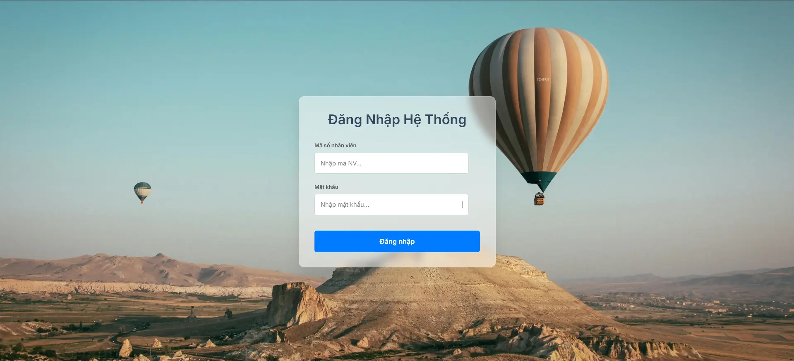
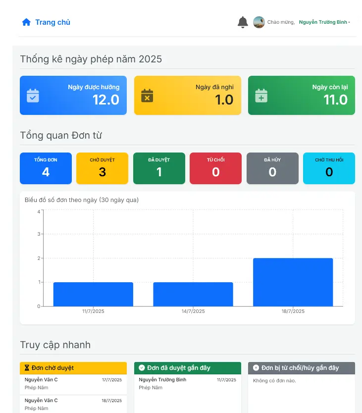
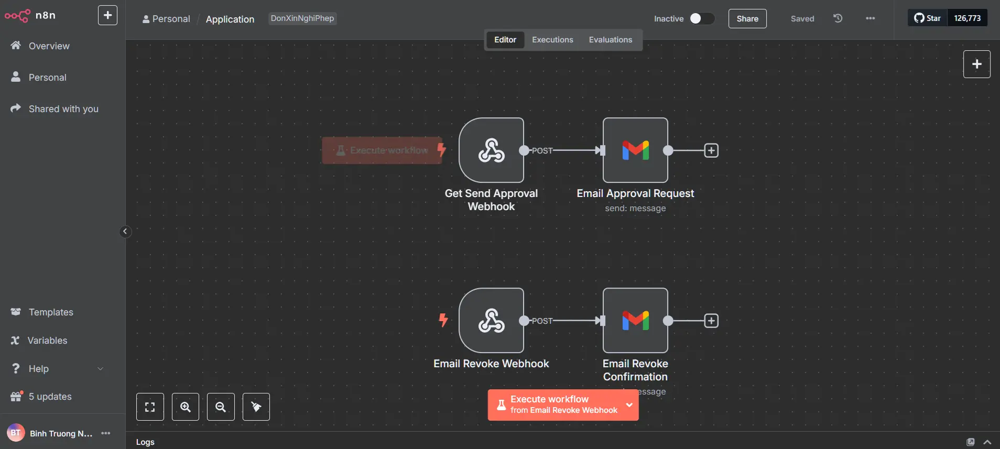
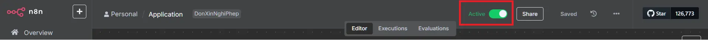

# Hệ thống Quản lý Nhân sự & Nghỉ phép (Microservices)

Đây là một dự án demo xây dựng một hệ thống quản lý nhân sự và đơn xin nghỉ phép hoàn chỉnh dựa trên kiến trúc Microservice. Hệ thống bao gồm các service backend được viết bằng .NET, một gateway, và một giao diện người dùng bằng ReactJS, tất cả được đóng gói và quản lý bằng Docker.

## Tính năng chính

### Kiến trúc & Hạ tầng
* **Kiến trúc Microservice:** 5 service backend (.NET) và 1 service frontend (ReactJS).
* **Containerization:** Toàn bộ hệ thống được quản lý và triển khai bằng Docker & Docker Compose.
* **Cơ sở dữ liệu:** Sử dụng **PostgreSQL** cho dữ liệu chính và **MongoDB** cho dữ liệu của API Gateway.
* **Di dời dữ liệu:** Tự động di dời dữ liệu từ SQLite sang PostgreSQL bằng `pgloader`.
* **Giám sát sức khỏe (Health Checks):** Tích hợp health check cho tất cả các service backend.

### Xác thực & Phân quyền
* **Xác thực JWT:** An toàn với JSON Web Token, thời hạn 8 giờ và cơ chế gia hạn.
* **Phân quyền theo vai trò:** Hỗ trợ 3 cấp độ: Admin, SuperUser, và User.

### Chức năng
* **Quản lý Nhân viên:** CRUD, tìm kiếm, lọc, xóa mềm, quản lý thùng rác và khôi phục.
* **Quản lý Đơn xin phép:** Tạo, duyệt, từ chối, hủy, và yêu cầu thu hồi đơn.
* **Hệ thống Thông báo:** Thông báo theo thời gian thực (Real-time) qua SignalR.
* **Nhật ký Hệ thống:** Ghi lại và cho phép Admin truy vết mọi hoạt động.
* **Xuất file Excel:** Xuất danh sách nhân viên và đơn xin phép.

## Công nghệ sử dụng

* **Backend:** .NET 8, ASP.NET Core, Dapper, EPPlus
* **Frontend:** ReactJS, Vite, Axios, Tailwind CSS
* **Database:** PostgreSQL, MongoDB
* **Hạ tầng:** Docker, Docker Compose, Nginx
* **Migration:** pgloader

## Cài đặt và Chạy

### Yêu cầu
* [Git](https://git-scm.com/)
* [Docker](https://www.docker.com/) & Docker Compose

### Hướng dẫn cài đặt Docker (Ví dụ cho Debian 12)
*Do dự án chạy trên Debian 12 no GUI, hướng dẫn này tập trung vào Debian. Với các hệ điều hành Linux khác, vui lòng tham khảo tài liệu chính thức của Docker.*

1.  **Thiết lập kho lưu trữ của Docker:**
    ```bash
    # Cài đặt các gói cần thiết
    sudo apt-get update
    sudo apt-get install ca-certificates curl
    
    # Thêm GPG key chính thức của Docker
    sudo install -m 0755 -d /etc/apt/keyrings
    sudo curl -fsSL https://download.docker.com/linux/debian/gpg -o /etc/apt/keyrings/docker.asc
    sudo chmod a+r /etc/apt/keyrings/docker.asc

    # Thêm repository vào danh sách nguồn của Apt
    echo \
      "deb [arch=$(dpkg --print-architecture) signed-by=/etc/apt/keyrings/docker.asc] https://download.docker.com/linux/debian \
      $(. /etc/os-release && echo "$VERSION_CODENAME") stable" | \
      sudo tee /etc/apt/sources.list.d/docker.list > /dev/null
    sudo apt-get update
    ```

2.  **Cài đặt Docker Engine:**
    ```bash
    sudo apt-get install docker-ce docker-ce-cli containerd.io docker-buildx-plugin docker-compose-plugin -y
    ```

3.  **Cho phép user chạy Docker không cần `sudo` (Khuyến nghị):**
    ```bash
    sudo usermod -aG docker $USER
    ```
    *Lưu ý: Sau khi chạy lệnh này, bạn cần **đăng xuất và đăng nhập lại** để thay đổi có hiệu lực.*

### Các bước triển khai dự án

1.  **Clone repository:**
    ```bash
    git clone [Link đến repo của bạn]
    cd [Tên thư mục repo]
    ```

2.  **Tạo file môi trường `.env`:**
    Tạo một file tên là `.env` ở thư mục gốc và điền các thông tin sau:
    ```env
    DB_SERVER=db
    DB_PORT=5432
    DB_USER=ten_user
    DB_PASSWORD=Password_cua_ban
    ```

3.  **Khởi động hệ thống:**
    * Nếu có các container cũ đang chạy, hãy dừng chúng lại:
    ```bash
    docker compose down -v
    ```
    * Xóa các image rác (tùy chọn):
    ```bash
    docker system prune -f --volumes
    ```
    * Build và khởi động hệ thống ở chế độ nền:
    ```bash
    docker compose up --build -d
    ```
    * Sau khi chạy xong, bạn sẽ thấy kết quả tương tự như sau là thành công:
    

4.  **Truy cập ứng dụng:**
    * **Frontend:** [http://localhost:5173](http://localhost:5173)
    
    
    * **API Gateway:** [http://localhost:5081](http://localhost:5081)
    
5.  **Cấu hình n8n (Tùy chọn):**
    * Mở n8n và nhập file `Application_LeaveRequest_v3_MicroServices.json`.
    * **Workflow** -> **Import** -> **Import from File...**
    
    * Sau khi import, chuyển công tắc từ **Inactive** sang **Active** để kích hoạt workflow.
    

6.  **Các lệnh Docker hữu ích:**
    * Xem các container đang chạy:
    ```bash
    docker ps
    ```
    * Xem log của một service cụ thể:
    ```bash
    docker compose logs -f <ten_service>
    ```
    * Xóa toàn bộ logs trong Docker (thận trọng khi dùng):
    ```bash
    sudo sh -c 'truncate -s 0 /var/lib/docker/containers/*/*-json.log'
    ```
    
## Triển khai Offline

Hệ thống hỗ trợ triển khai trên các máy không có mạng Internet.

1.  **Trên máy có mạng:**
    * Build tất cả image ứng dụng: `docker compose build`.
    * Đóng gói tất cả image cần thiết vào một file:
    ```bash
    docker save -o all_images.tar \
      microservices-leave-request-service:latest \
      microservices-user-service:latest \
      microservices-user-dashboard:latest \
      microservices-notifications-service:latest \
      microservices-audit-logs-service:latest \
      microservices-api-gateway:latest \
      mongo:latest \
      mcr.microsoft.com/dotnet/sdk:8.0 \
      mcr.microsoft.com/dotnet/aspnet:8.0 \
      node:20-alpine \
      postgres:17-alpine \
      nginx:stable-alpine \
      dimitri/pgloader:latest
    ```

2.  **Trên máy offline:**
    * Copy thư mục dự án và file `all_images.tar` sang.
    * Đảm bảo các file `docker-compose.yml`, `.env`, `init.sql`, `migrate.load` nằm đúng vị trí.
    * Nạp các image vào Docker:
    ```bash
    docker load -i all_images.tar
    ```
    * Khởi động hệ thống:
    ```bash
    docker compose up -d
    ```

## Tác giả

* **Hệ thống Quản lý Nhân sự & Nghỉ phép (Microservices)** - [[Nguyễn Trường Bình](https://github.com/Binhbnt)]